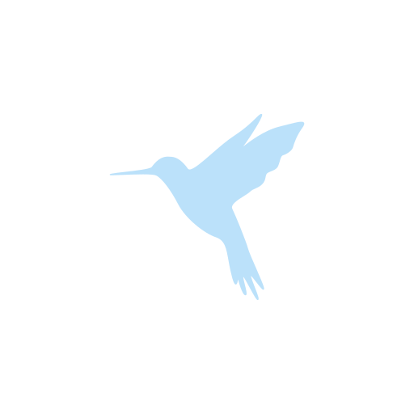

# Humming Note

 

## About

Note taking app inspired from Google Keep and Hummingbird

 

## Status

The app is still in development, but you can check out our pre release builds from [release](https://github.com/sarthakpranesh/HummingNote/releases)

 

## Contributions

If you are looking to help out build this app you are more then welcome. For a start you can try installing the app and report issues like improper UI scaling, breaking UI, any bugs encountered, suggestion to improve the app, etc. For contributing changes like bug fixes/feature enhancement/etc please follow the developer contribution guidelines (will be added soon)

 

## Attributions

Thanks to all the free assets/content/guides/etc made available by the Open Source communities and others. Some resources used in this app have been attributed below

* 
Icons made by <a href="https://www.flaticon.com/authors/freepik" title="Freepik">Freepik</a> from <a href="https://www.flaticon.com/" title="Flaticon">www.flaticon.com</a>

 

## Bugs/Errors/Issues

If you encounter any problem while using this app, please feel free to open an issue. Doing so will greatly help in improving the quality and experience provided by the app.

